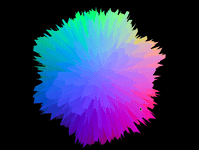

# Dag 2: Dypdykk i shaderprogrammering

## Teori

- [Introduksjon til shadere](https://bekk.github.io/3d-visualisering-kursserie/dag2/slides/om-shadere.html)

## Oppgave 5

> Wobbling sphere

I denne oppgaven skal vi lære litt om hva slags artige effekter vi kan lage med vertex shadere:



### Utdelt oppsett

I mappen `oppgave-5-vertex-shader` finner du et oppsett med den vanlige boilerplate-koden. Her skal du skrive koden for å løse denne oppgaven i `index.js`. Det er ikke meningen å fortsette på forrige oppgave.

Siden du allerde har blitt kjent med `dat.GUI` og sikkert merka hvor kjekt det er, har vi inkludert det i den utdelte koden. Underveis vil vi peke på variabler det kan være arti å kunne kontrollere og endre.

Du kjører koden i denne mappa med kommandoen

```sh
npm run start5
```

### Lag en sphere

Det første vi trenger å gjøre er å lage en sphere, som vi kan bruke til å utforske hva vertex shadere kan gjøre.

Three.js har heldigvis en ferdig [`SphereGeometry`](https://threejs.org/docs/index.html#api/en/geometries/SphereGeometry) vi kan benytte oss av til å lage spheren vår.

```js
let geometry = new THREE.SphereGeometry([radius]);
```

Vi kan kombinere den geometrien med et materiale og lage et objekt vi kan legge til scenen vår.

```js
let material = new THREE.ShaderMaterial({
  vertexShader: vertexShaderCode,
  fragmentShader: fragmentShaderCode
});

sphere = new THREE.Mesh(geometry, material);
scene.add(sphere);
```

Hvis du har gjort ting rett, vil du nå se en hvit sirkel på skjermen din. Ikke veldig spennende, men det kan vi fikse på!

### Uniforms, attributes og varyings

Før vi går videre tar vi en liten teoripause. Vi har lært om `uniform`, men i webgl er det faktisk definert tre typer variabler som shaderkoden bruker. Forskjellen mellom dem er

- når de kan endres
- hvilken kode som kan lese dem
- når de leses, om man får verdien deres direkte eller en interpolasjon mellom to nabo-verdier

De tre typene er

- `uniform` Variabler som kan skrives av JavaScript-koden og sendes over 1 gang per rendret bilde, er read-only for shaderne og har samme globale verdi for alle vertices og alle piksler til hvert Mesh
  - For eksempel tid, museposisjon, animasjonshastighet, osv
  - Hensikten med dette er at GPU-en så kan kjøre shaderkoden uten å gjøre flere trege dataoverføringen fra resten av datamaskinen
- `attribute` Samme som uniform, men kan kun leses i vertex shader, og skal ha en separat verdi for hver eneste vertex
  - For eksempel farge, teksturkoordinat, osv
  - Hensikten med denne typen er at GPU-en kan optimalisere minnet og kjernene sine slik at flest mulig beregninger kan kjøre samtidig uten å måtte snakke sammen
- `varying` Kan ikke skrives til av JavaScript-koden, men av vertexshaderen. Får dermed en separat verdi per vertex. Men den kan leses av fragmentshaderen, og den verdien som leses da er interpolert mellom de tre vertexene som pikselen er mellom
  - Typisk eksempel er den interpolerte fargen pikselen skal ha fra en tekstur. Men generelt er denne typen brukt hvis man vil at vertexshaderen skal beregne en verdi som fragmentshaderen igjen skal bruke til å beregne fargen. Slik kan vertex shader og fragment shader snakke sammen.

### Gjøre spheren spennende!

For å live opp spheren vår, og for å få frem 3D-effekten trenger vi litt farge. Farge er, som vi har lært, jobben til fragment-shaderen. I dag1 brukte vi et spesielt materiale som het `MeshNormalMaterial` for å få en farge som så ganske ålreit ut right out of the gate. Vi kan benytte oss av en lignende teknikk her nå for å gi spheren vår gøy farge.

Alle geometrier i three.js har definert en vektor som heter `normal`, det er den vektoren som peker rett ut (aka perpendicular aka 90grader) fra hvert punkt. Three.js kan vise oss normal-vektorene med en hendig hjelpefunksjon:

```js
let helper = new THREE.VertexNormalsHelper(
  sphere,
  [lengde],
  [farge],
  [tykkelse]
);
scene.add(helper);
```

Det vil vise oss alle normal-vektorene som gjelder for spheren vår. Og som du ser så peker alle normal-vektorene vekk fra sentrum av spheren.

Det vi skal gjøre er å bruke normal-vektoren til å fargelegge spheren. Måten vi gjør det på er å bruke en `varying`:

`vertexshader.glsl`:

```c
varying vec3 normalVec;

void main() {
  // gi en varying en verdi
  normalVec = normal;

  // resten av koden
}
```

`fragmentshader.glsl`:

```c
varying vec3 normalVec;

void main() {
  vec3 color = normalVec;

  // resten av koden
}
```

Det som er veldig viktig her er at variabelnavnet på en `varying` matcher, ellers klarer ikke shaderene å sende dataene.

Hvis du har gjort alt rett til nå vil du få en sphere som er ganske regnbuefarget. Bortsett fra en liten kvadrant som er helt svart. Det er ikke helt ideelt, men det kan vi fikse på! Hvis vi reduserer legnden på normalvektoren (med andre ord, redusere det aktuelle farge-spekteret) ved å gange med `0.5` og så legger til `0.5` for å flytte fargespekteret litt vil vi få en farge som ligner veldig på `MeshNormalMaterial` fra dag1.

`fragmentshader.glsl`:

```c
vec3 color = normalVec * 0.5 + 0.5;
```

Du kan kommentere ut `VertexNormalsHelper` for å ta vekk normalvektor-pilene.

### Vertex shader in practice

Nå er vi klare for å se hva vertex-shadere er i stand til å gjøre.

Det første vi vil gjøre er å konvertere normal-vektorene til sphere-geometrien til noe som heter `face normals`. `face normals` er normal-vektoren til ett triangel i WebGL. Dermed vil alle vertices som sammen utgjør et triangel få en felles normal-vektor.

```js
geometry.computeFlatVertexNormals();
```

Du vil ikke merke noen forskjell enda, men hvis vi går inn i `vertexshader.glsl` og legger til følgende snutt:

```c
vec3 offsetPos = position.xyz + 0.5 * normal;
vec4 modelSpaceCoordinates = vec4(offsetPos, 1.0);
```

Så vil du se at spheren består av mange mindre biter. Vi kan nå fikle litt med parameterene til SphereGeometry for å se hvordan kuler faktisk er skrudd sammen i WebGL:

```js
let geometry = new THREE.SphereGeometry(10, 128, 64);
```

De to ekstra parameterene er hvor mange horisontale og vertikale "bånd" som skal utgjøre spheren.

> De tre parameterene til `SphereGeometry` er gøyale parametre å koble til dat.GUI. Følg samme fremgangsmåte som i oppgave4. NB: Når et av parameterne blir endra på, må du re-initialisere spheren. Det kan du gjøre ved å hekte på en `.onChange(reinit)` bak hvert parameter du definerer. `reinit`-funksjonen må du lage selv, den trenger å gjøre to ting: `scene.remove(sphere)` og `initSphere()`.

Det vi har gjort er å flytte hver face litt langs normalvektoren. WebGL benytter seg av triangler, men vi ser firkanter over alt. Det skyldes at to og to triangler har identisk normalvektor og dermed flytter seg likt. Vi kan ha det litt gøy med dette og tweake på hvor langt vi flytter ting langs normalvektoren ved å endre på `0.5` i `vertexshader.glsl`.

Nå har du forhåpentligvis fått et lite innblikk i hva en vertex shader kan gjøre.

### Ikke-uniform distortion

Det er ganske kjedelig når alle vertices flytter seg helt likt, så vi kan introdusere litt randomness for å få en gøyal effekt.

Det første vi skal gjøre er å gå tilbake til vanlige vertex normals, ikke facenormals. Så du kan fjerne kodesnutten som beregner face normals:

```diff
-geometry.computeFlatVertexNormals();
```

Nå er vi tilbake til at hver vertex har sin egen normal-vektor og da ser plutselig spheren helt kontinuerlig ut igjen.

For å kunne gi hver vertex en unik random-verdi trenger vi å bruke en `attribute`. For å hekte på en `attribute` i three.js må vi endre litt på hvordan vi definerer geometrien:

```diff
-let geometry = new THREE.SphereGeometry(10, 128, 64);
+let geometry = new THREE.SphereBufferGeometry(10, 128, 64);
```

Det vi endrer på er at vi bruker en `BufferGeometry` istedenfor en vanlig `Geometry`. Dette er en litt mer avansert komponent i three.js, som vi må bruke for å få tilgang på `attributes`.

For å legge til attributes trenger vi en array som er like lang som antall vertices i geometrien (siden vi skal ha en verdi for hver vertice). Og vi kan ikke bruke en hvilkensomhelst array, vi må bruke en såkalt `Typed Array`. Dette er for at three.js skal klare å sende dataene over til GPUen på riktig måte.

```js
displacement = new Float32Array(geometry.attributes.position.count);
```

Her oppretter vi en `Float32Array` som er like lang som antallet unike posisjoner (som er en attributt som three.js automatisk genererer og som alltid er riktig lengde). Nå kan vi assigne en unik random-verdi per element i `displacement`:

```js
for (var i = 0; i < displacement.length; i++) {
  displacement[i] = Math.random() * 5;
}
```

> `5`-tallet i kodesnutten over er også et bra eksempel på et parameter det er gøy å tweake med dat.GUI.

For å sende med våre random displacement verdier til shaderen trenger vi en liten bit til med kode:

```js
geometry.addAttribute(
  "displacement",
  new THREE.BufferAttribute(displacement, 1)
);
```

Dette forteller three.js at vi har en `attribute` som heter `displacement` som inneholder dataene fra den arrayen vi akkurat laga og at den har `1` verdi per vertice.

Nå kan vi lese ut den verdien i shaderen vår:

`vertexshader.glsl`:

```c
varying vec3 normalVec;
attribute float displacement;

void main() {
  normalVec = normal;
  vec3 offsetPos = position.xyz + displacement * normal;

  // resten av koden
}
```

Hvis du har gjort alt rett til nå har vi fått en sphere som ser ut som en regnbuefarget hårball 👌

### Wobble that sphere!

Som et siste lille triks så kan vi endre `displacement`-attributten vår på hver render og på den måten få en wobbly sphere. For å gjøre det må vi legge til litt kode i `render`-funksjonen vår:

```js
let time = Date.now() * 0.01; // timestamp i sek;
for (let i = 0; i < displacement.length; i++) {
  displacement[i] = Math.sin(0.1 * i + time);
}
```

Nå endrer vi displacement til en sinus-funksjon av indexen til vertexen som blir forskjøvet av et timestamp. Du vil nå se en sphere som har en ganske wobbly overflate, men den animerer ikke.

Det er fordi three.js ikke detekterer endringer i attributes på samme måte som med `uniforms` (fra oppgave 4). Så vi må eksplisitt si i fra til three.js at nå har vi endra på verdien til en attribute:

```js
sphere.geometry.attributes.displacement.needsUpdate = true;
```

Nå vil vi se at displacement flytter seg omtrent som en bølge. Men vi har mista litt av hårball-effekten vi laga i forrige oppgave, den vil vi gjerne ha tilbake.

Vi starter med å lage en egen noise-array, som vi kan holde på litt randomverdier, samme sted som vi initialiserer spheren:

```
noise = new Float32Array(displacement.length);
```

Og så endrer vi på for-løkka vår slik at vi heller initialiserer noise-arrayen med random-verdier:

```diff
for (let i = 0; i < displacement.length; i++) {
-  displacement[i] = Math.random() * 5;
+  noise[i] = Math.random() * 5;
}
```

Og så endrer vi render-funksjonen vår slik at vi heller akkumulerer støy i noise-arrayen og legger det sammen med displacement-verdien:

```diff
let time = Date.now() * 0.01; // timestamp i sec;
for (var i = 0; i < displacement.length; i++) {
  displacement[i] = Math.sin(0.1 * i + time);
+
+  noise[i] += -0.5 + Math.random();
+  noise[i] = THREE.Math.clamp(noise[i], -5.0, 5.0);

+  displacement[i] += noise[i];
}
sphere.geometry.attributes.displacement.needsUpdate = true;
```

Nå legger vi på litt random (en verdi mellom -0.5 og 0.5) hver gang vi renderer og bruker `THREE.Math.clamp` til å holde verdien til minimum `-5` og maksimum `5` (akkurat samme funksjon som du brukte i oppgave 4).

> Her kan du også koble på max/min verdien til clamp-funksjonen på dat.GUI. Kan tilogmed bruke samme parameter som blir brukt til å initialisere noise-arrayen i init-koden.

Hvis du har gjort alt rett til nå vil du nå se en hårete regnbuefarget sphere som wobbler 👍
